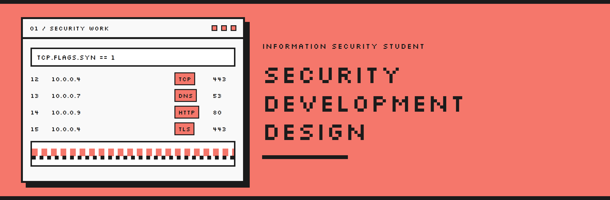

  

  
  
  
  

I'm an information security student. The work I care about sits across cybersecurity, software, and visual design. I like understanding how something works, then turning that into a tool or a piece someone can actually use.

Right now that points toward network security, application security, digital forensics, and blue team work. I keep the practice going on TryHackMe, Hack The Box, and CyLab Academy.

Projects, visual work, and a longer introduction are on the portfolio.

  

